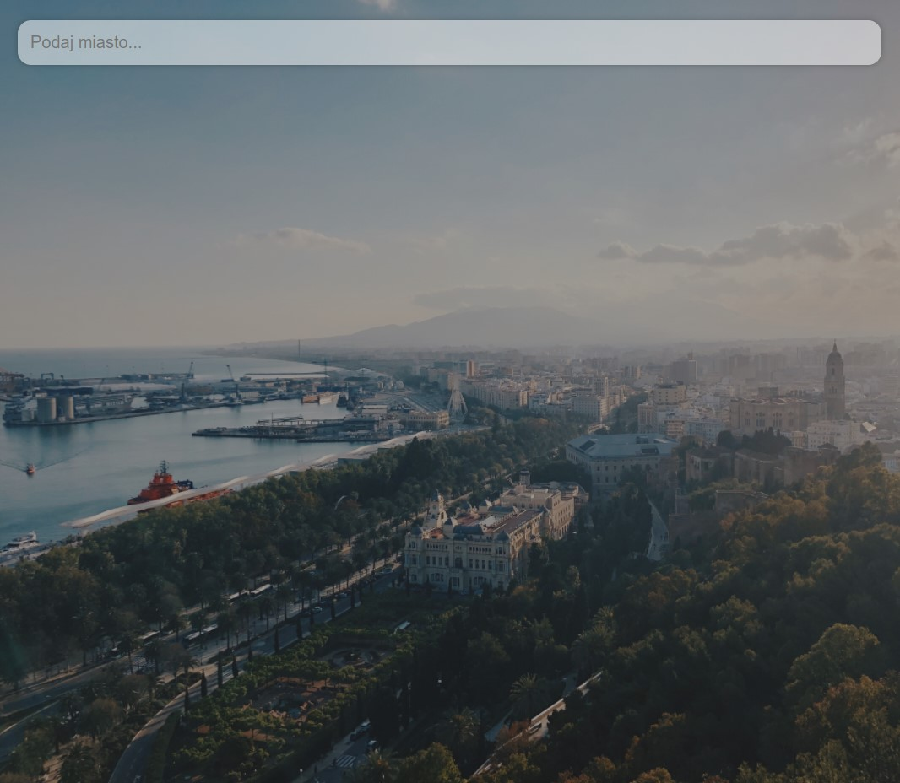
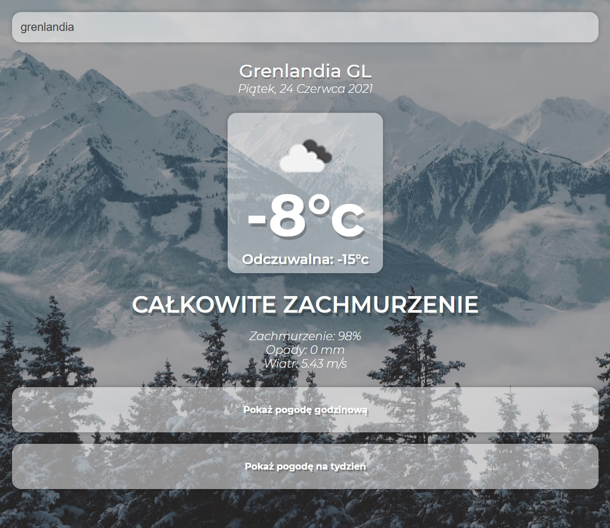
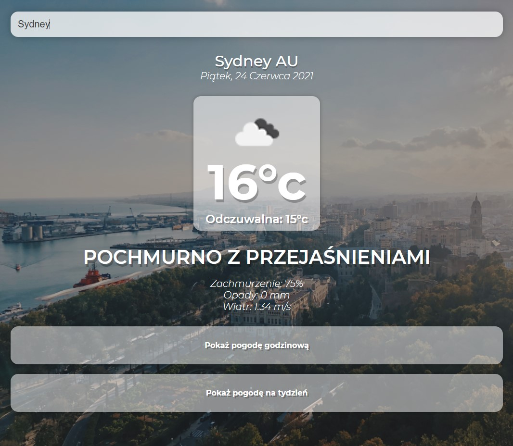
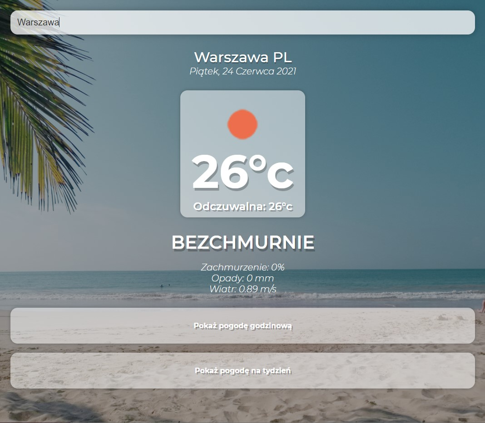

# WeatherApp
Web application using Vue.js and OpenWeatherMap API.
	
## Technologies
Project is created with:
* Vue.js
* OpenWetaherMap API
	
## Installation
To run this project:

* Download project
* Put project folder inside htdocs folder (path is something like this C:\xampp\htdocs)
* In terminal go to project directory and type: $ yarn serve
* Go to the browser and type in URL field: localhost:8080 (or change port number)

## Functionality
* Show current weather
* Show daily weather forecast 
* Show hourly weather forecast 

