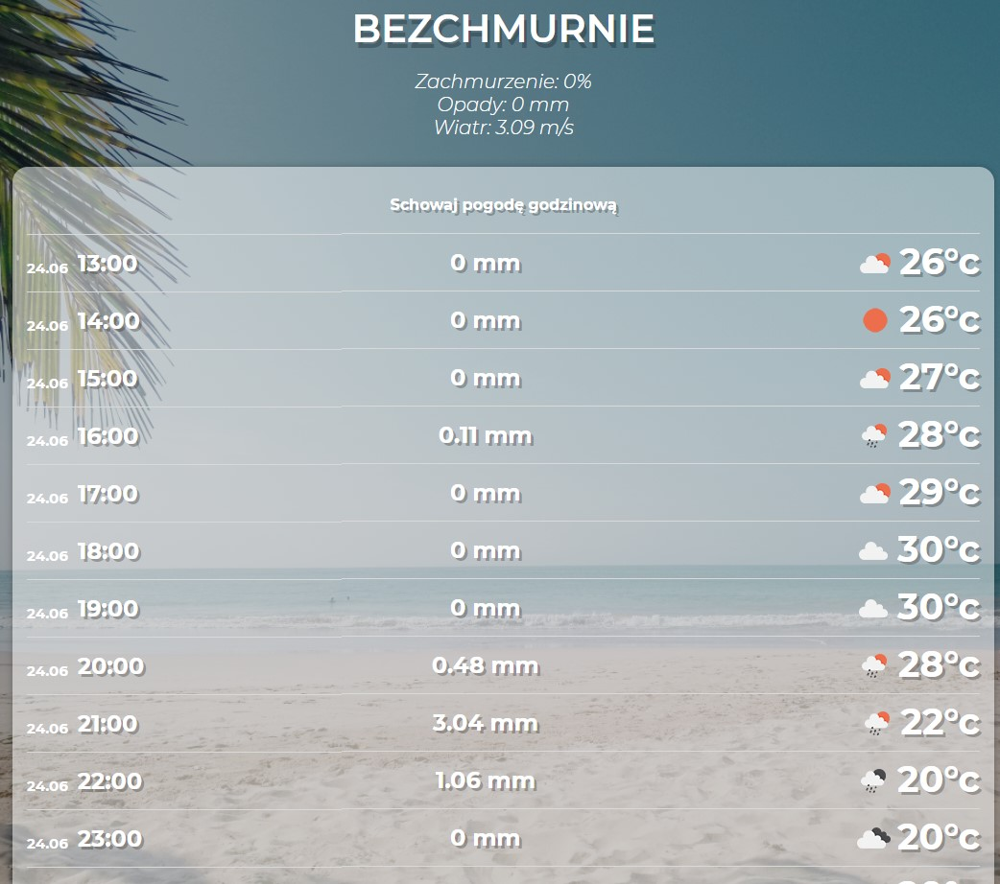
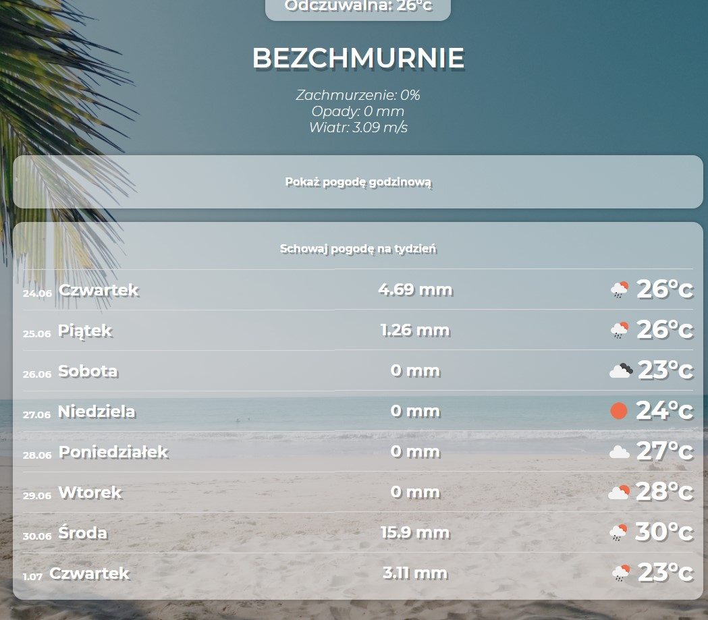

# WeatherApp
Web application using Vue.js and OpenWeatherMap API.
	
## Technologies
Project is created with:
* Vue.js
* OpenWetaherMap API

## Functionality
* Show current weather
* Show daily weather forecast 
* Show hourly weather forecast 

